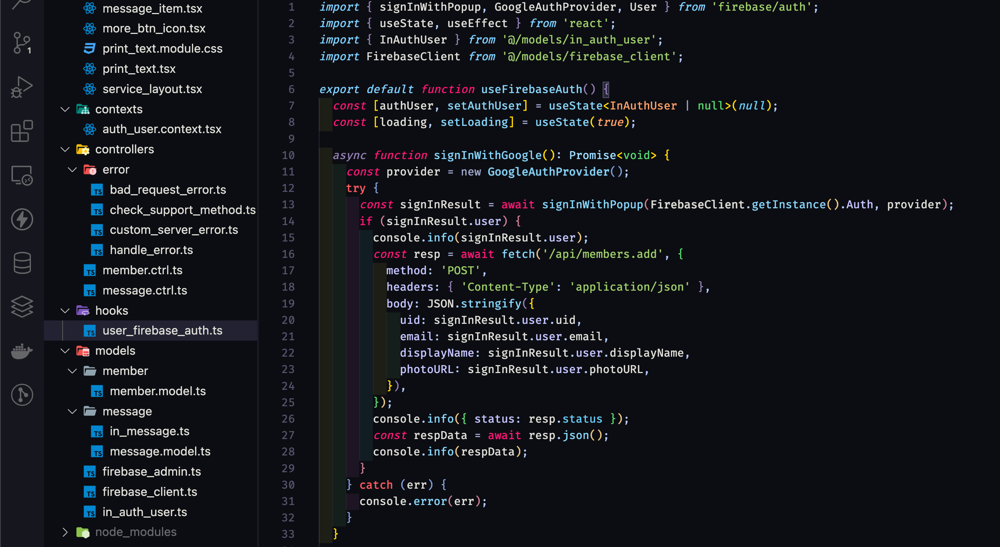
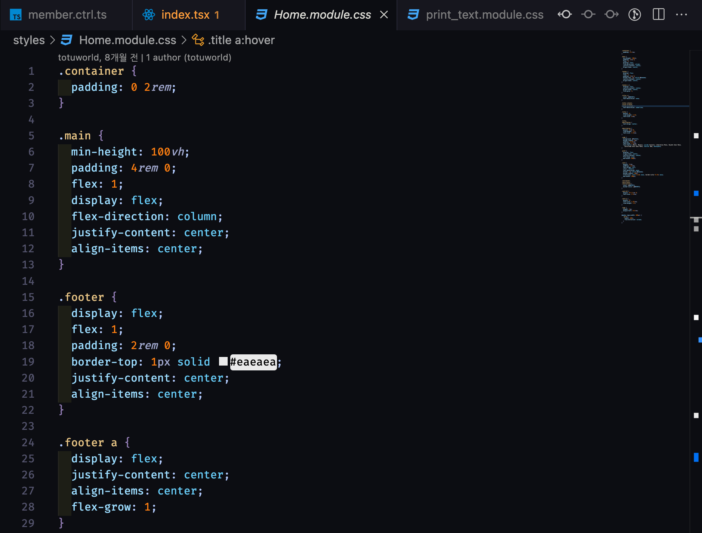

# Tanuki

**Hello World!**

This is My First VS Code Theme Customization.

### Thanks for **<a href="https://github.com/rebelot/kanagawa.nvim/" target="_blank" rel="noopener">Kanagawa</a>** and **<a href="https://github.com/jeroen-meijer/shibuya" target="_blank" rel="noopener">Shibuya</a>** !!

 

<figure>

</figure>

 
 

<figure>

</figure>

 

# Color Palette

|                                                                                                                                           |      Name      |     Hex     |                                       Usage                                       |
| :---------------------------------------------------------------------------------------------------------------------------------------: | :------------: | :---------: | :-------------------------------------------------------------------------------: |
|  
  |  tanukiWhite   |  `#DEDDD7`  |                                Default Foreground                                 |
|  
  | tanukiOldWhite |  `#C9C6B8`  |                           Dark foreground (statuslines)                           |
|  
  | tanukiIndigo0  |  `#282837`  |                Dark background (statuslines and floating windows)                 |
|  
  | tanukiIndigo1  |  `#0C0D12`  |                                Default background                                 |
|  
  | tanukiIndigo2  |  `#16161E`  |                      Lighter background (colorcolumn, folds)                      |
|  
  | tanukiIndigo3  |  `#222232`  |                          Lighter background (cursorline)                          |
|  
  | tanukiIndigo4  |  `#54546D`  | Darker foreground (line numbers, fold column, non-text characters), float borders |
| 
 |  shibuyaBlue0  | `#0c0d12e7` |                   Popup background, visual selection background                   |
|  
  |  shibuyaBlue1  |  `#161C39`  |                   Popup selection background, search background                   |
|  
  |  shibuyaBlue2  |  `#658594`  |                                  Diagnostic Hint                                  |
|  
  |  otaruGreen0   |  `#2B3328`  |                               Diff Add (background)                               |
|  
  |  otaruGreen1   |  `#87D034`  |                                      Git Add                                      |
|  
  |    otaruRed    |  `#C34043`  |                                    Git Delete                                     |
|  
  |  tanukiYellow  |  `#DCA561`  |                                    Git Change                                     |
|  
  |   tanukiRed    |  `#E82424`  |                                 Diagnostic Error                                  |
|  
  |   akiYellow    |  `#FF9E3B`  |                                Diagnostic Warning                                 |
|  
  |   fuyuAqua0    |  `#70b8a3`  |                                  Diagnostic Info                                  |
|  
  |   fuyuAqua1    |  `#56D66D`  |                                      Types 1                                      |
|  
  |   fuyuAqua2    |  `#9CDCFE`  |                                      Types 2                                      |
|  
  |    fujiGray    |  `#696b72`  |                                     Comments                                      |
|  
  |   oniViolet    |  `#957FB8`  |                             Statements And Keywords 1                             |
|  
  |    oniCyan     |  `#7DCFFF`  |                             Statements And Keywords 2                             |
|  
  |   oniMagenta   |  `#FF1778`  |                             Statements And Keywords 3                             |
|  
  |    fuyuBlue    |  `#7E9CD8`  |                              Functions and Titles 1                               |
|  
  |  fuyuSkyBlue   |  `#86D3F7`  |                              Functions and Titles 2                               |
|  
  |   fuyuViolet   |  `#B1CAFD`  |                             Brackets and punctuation                              |
|  
  |    haruBlue    |  `#67CBF6`  |                          Specials and builtin functions                           |
|  
  |   natsuBlue    |  `#5ED4D6`  |                                     Not used                                      |
|  
  |   haruGreen    |  `#9ECE6A`  |                                      Strings                                      |
|  
  |  natsuViolet   |  `#A0A7CD`  |                                 Operators, RegEx                                  |
|  
  |  natsuYellow   |  `#E6C384`  |                                   Identifiers 1                                   |
|  
  |   moriViolet   |  `#C7CCD4`  |                                   Identifiers 2                                   |
|  
  |   sakuraPink   |  `#D27E99`  |                                     Numbers 1                                     |
|  
  |  sakuraOrange  |  `#FF7F11`  |                                     Numbers 2                                     |
|  
  |   tanukiRed0   |  `#E46876`  |                      Standout specials 1 (builtin variables)                      |
|  
  |   tanukiRed1   |  `#FF5D62`  |                 Standout specials 2 (exception handling, return)                  |
|  
  |  surimiYellow  |  `#FFD700`  |                          Constants, imports, booleans 1                           |
|  
  |  surimiOrange  |  `#FFA066`  |                          Constants, imports, booleans 2                           |
|  
  |   tokyoAbyss   |  `#20264E`  |                                 Selection Color 1                                 |
|  
  |   tokyoGreen   |  `#9BC968`  |                                 Selection Color 2                                 |
|  
  |  tokyoViolet   |  `#C3C3FF`  |                                  Other Variables                                  |

